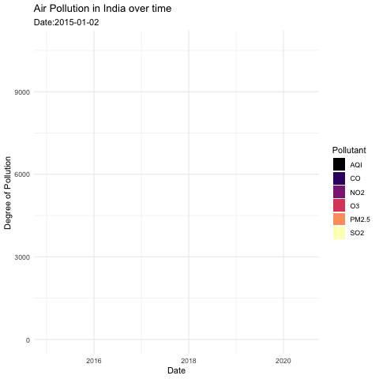

```{r setup, include=FALSE}
#knitr::opts_chunk$set(echo = TRUE)
```


```{r}
library(tidyverse)
library(lubridate)     
library(ggthemes)      
library(geofacet)     
library(maps)          # for map data
library(ggmap)         # for mapping points on maps
library(gplots)        # for col2hex() function
library(RColorBrewer)  # for color palettes
library(sf)            # for working with spatial data
library(leaflet)       # for highly customizable
library(gganimate)
library(openintro)
theme_set(theme_minimal())
```


```{r}
india_coordinates <- readr::read_csv('https://raw.githubusercontent.com/ayushi98/DS-project/main/Indian%20Cities%20Database.csv') #For Indian Cities' Latitude and Longitude
india_pollution <- readr::read_csv('https://raw.githubusercontent.com/ayushi98/DS-project/main/city_day.csv') #For Indian Cities' Pollution Levels
```

```{r}
india_city_pollution <-
  india_pollution %>% 
  left_join(india_coordinates,
            by = c("City")) %>% 
  pivot_longer(cols = c("PM2.5", "NO2", "CO", "SO2", "O3","AQI"),
               names_to = "Pollutant",
               values_to = "degree_pollution")

print(india_city_pollution)
```


```{r}
india_city_pollution %>% 
  filter(City == "Ahmedabad") %>% 
  ggplot(aes(x = Date, y = AQI)) +
  geom_line()
```

```{r}
total_india<- 
  india_city_pollution %>% 
  mutate(weekday = wday(Date, label=TRUE)) %>% 
  filter(weekday == "Fri") %>% 
  ggplot(aes(x = Date, y = degree_pollution), position = position_stack())+
  geom_area(aes(fill = Pollutant))+
  labs(title = "Air Pollution in India over time ",
       subtitle = "Date:{closest_state}",
       x = "Date",
       y = "Degree of Pollution")+
  scale_fill_viridis_d(option = "magma")+
  transition_states(Date)

anim_save("total_india.gif", total_india)
```

```{r}

```


```{r}
india <- get_stamenmap(
    bbox = c(left = 61.188, bottom = 8.026, right = 106.542, top = 36.502), 
    maptype = "terrain",
    zoom = 5)

ggmap(india)+
geom_point(data = india_city_pollution %>% filter(Date == c("2015-05-31", "2016-05-31", "2017-05-31", "2018-05-31","2019-05-31", "2020-05-31")), 
           aes(x = Long, y = Lat, color = Pollutant, size = degree_pollution))+
  facet_wrap(~Date)+
  theme(legend.background = element_blank())+
  theme_map()
```

```{r}
ggmap(india)+
geom_point(data = india_city_pollution, 
           aes(x = Long, y = Lat, color = degree_pollution))+
  facet_wrap(~Pollutant)+
  theme(legend.background = element_blank())+
  theme_map()
```
```{r}
india_city_pollution %>%
  filter(Pollutant == "AQI") %>% 
  group_by(City, Pollutant) %>% 
  arrange(desc(degree_pollution)) %>% 
  head(10)
```


